# JUnit Test Manager Plugin

This plugin for IntelliJ IDEA simplifies the management and running of JUnit tests, allowing them to be grouped by profiles and regular expressions, as well as automating the search and relocation of test classes.

## Table of Contents
- [Requirements](#requirements)
- [Button Locations](#button-locations)
- [Settings Location](#settings-location)
- [Settings](#settings)
    - [Profiles](#profiles)
    - [Groups](#groups)
- [Functionality](#functionality)
- [Examples](#examples)
    - [Creating Configurations for Selected Tests](#creating-configurations-for-selected-tests)
    - [Creating Configurations for All Tests or Groups](#creating-configurations-for-all-tests-or-groups)
    - [Relocating Test Classes by Packages](#relocating-test-classes-by-packages)

## Requirements
- IntelliJ IDEA 2024.1 or higher
- Java 17 for IntelliJ IDEA runtime (versions 2024.1 and higher already require and support this version)

## Button Locations
The plugin buttons are available in the context menu when right-clicking in the code editor or on the project panel. They are grouped under the **JUnit Test Manager** item.

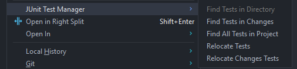

## Settings Location
The plugin settings are available in the **Settings** → **Tools** → **Test Manager Settings** section.

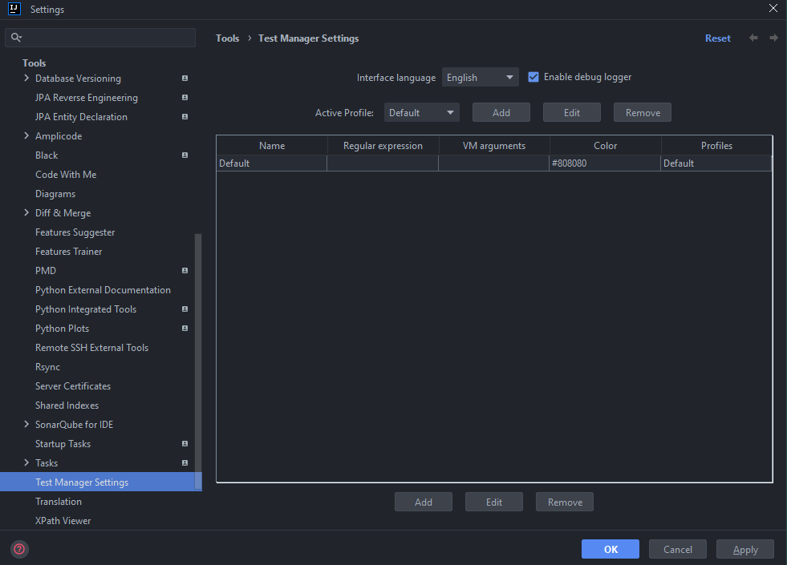

## Settings
The following options are available in the settings:
- Group management
- Profile management
- Interface language selection
- Logging flag

### Profiles
Profiles define which groups are active when grouping test classes, and also affect VM arguments and color highlighting.

### Groups
Groups are responsible for grouping test classes when forming run configurations and for defining VM arguments for these configurations. Groups allow automatically assigning categories to test classes based on file paths and applying specific run settings.

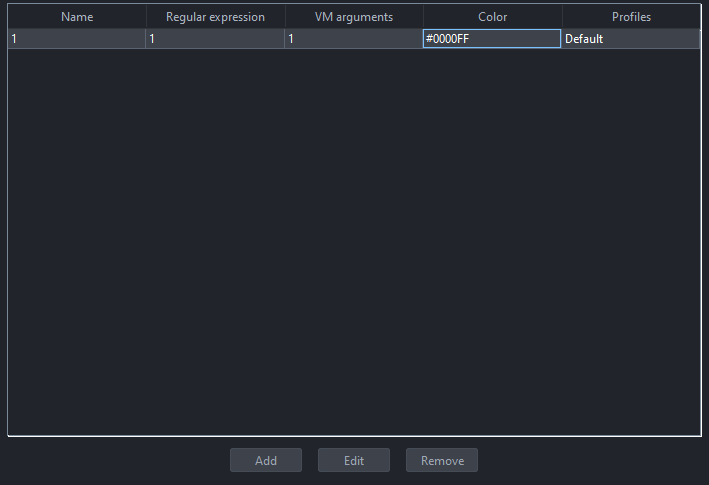

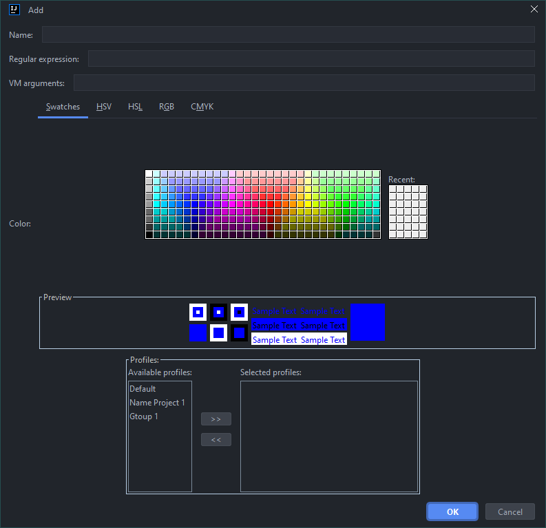

A group has 4 parameters:
- **Name**: The name of the group, displayed in the plugin interface and in configurations.
- **Regular Expression**: Determines which group a test belongs to, based on its path in the project. For example:
    - If you need to highlight all converters in the `Convert` group (it is known that they are located in packages with `convert` in the name), use the regular expression `.*convert.*`. Now any test that has `convert` in its path will be automatically assigned to this group. You can write more complex regular expressions — it depends on your imagination.
    - If regex is not set or does not match, the test falls into the default `Default` group. Regex supports standard Java syntax (Pattern.compile).
- **VM Arguments**: Java virtual machine arguments with which the test classes of this group will be run. For example:
    - `-Dparallel.tests=true -Dthreads=4` — for parallel test execution.
    - `-Xmx2g` — to increase heap size if test classes require a lot of memory.
- **Color**: Color for visual highlighting of the group in tables (cells are colored in this color). Default — gray. Helps to quickly distinguish groups in dialogs.
- **Profiles**: Defines for which profiles this group is suitable; they can be combined in case of different projects with similar groups.

Groups can be added, edited, and deleted directly from the settings. By default, there is always the `Default` group (without regex and VM arguments); it can be overridden by creating your own without regex and binding it to the `Default` profile.

## Functionality
Test classes are determined automatically:
- Classes with the `@Test` annotation (or `@ParameterizedTest` and similar).
- Classes inheriting from `junit.framework.TestCase`.
- Classes with a name ending in `Test`.

### 1. Find All Tests in Project
Finds **all** test classes in the project (recursively across all modules and test source roots).

### 2. Find Tests in Changes
Finds test classes that have been changed or added. To correctly track files, it is recommended to connect the project to Git so that IDEA can determine the changes.

### 3. Find Tests in Directory
Finds test classes in the selected directory (recursively). Available only when right-clicking on a directory in the project.

### 4. Relocate Tests
Analyzes all classes in `src/main/java`, finds related test classes in test source roots, and checks package correspondence:
- The test must be in the same package as the class (for example, `com.example.MyClass` → `com.example.MyClassTest`).
- The connection is determined by name (`ClassName + "Test"`) and the presence of the class import in the test.
- If the packages do not match, it offers to move the test to the class package (while preserving the test source root). Shows a dialog with a preview.

### 5. Relocate Changes Tests
Similar to `Relocate Tests`, but analyzes only **changed** classes in main source roots.

**Note**:
- Search and copying work for all tables.
    - For the functionality `Find Tests in Changes`, `Find All Tests in Project`, `Find Tests in Directory`:
        - Search only by class name;
        - When copying, only class paths are copied with a new line. If no specific test classes are selected, the configuration will be created for all tests by groups;
        - If selected, then only for the selected ones and by groups.
    - For the functionality `Relocate Tests`, `Relocate Changes Tests`:
        - Search only by class name;
        - When copying, only the class name is copied with a new line;
        - Double-clicking on a class name will open the file in IDEA.

## Examples
Simple settings are used for the examples.

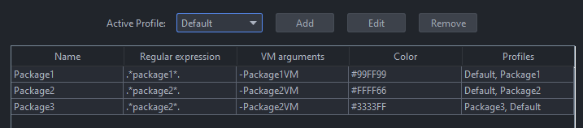

### Creating Configurations for Selected Tests
- The `package1` profile is active in the settings;
- The group has the regex `.*package1.*` specified.
- As you can see, 1 our group and the default group were determined.

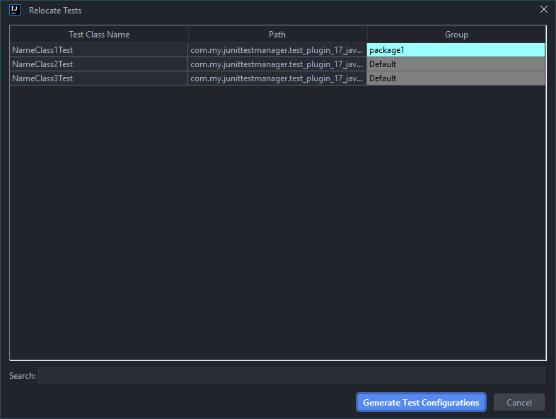

- For the example, the first 2 classes are highlighted to create configurations only for them. As a result, 2 configurations were created, and the arguments specified for our group were applied to one of them.

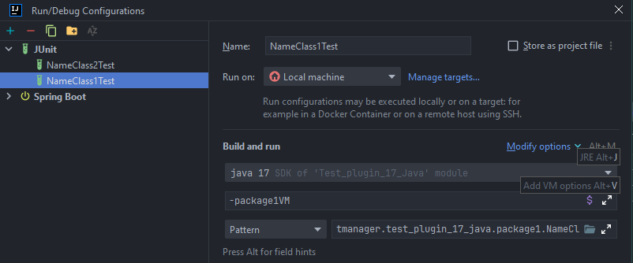

### Creating Configurations for All Tests or Groups
- Settings.

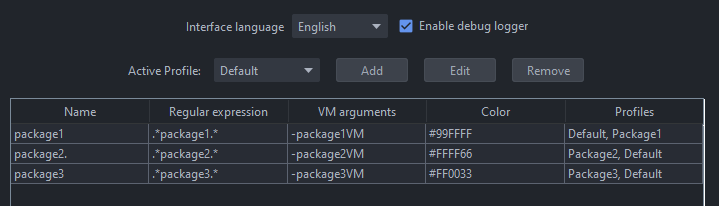

- Found test classes.

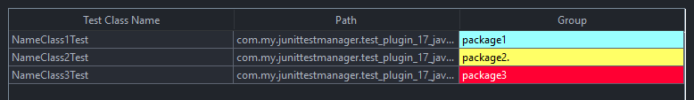

- Our configurations for each group.

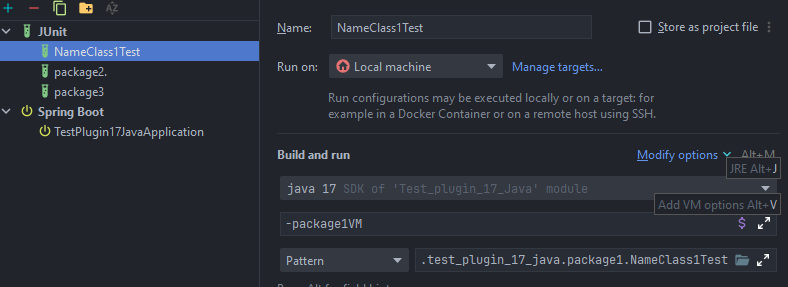

**Note**: In a test configuration for one group, there can be N test classes, they are specified via Pattern.

### Relocating Test Classes by Packages
The settings are the same as before, they do not affect this functionality. We analyze files in the main source root and look for test classes for them.
- We have a class `NameClass2`, located in `package2`, but we decided to move it to another package, for example, `package3`.
- Our test for this class remained in `package2`; it has the correct name `NameClass2Test` and has a reference to the class itself `NameClass2` in the imports, so this test class is suitable for relocation. We know where it should be placed.

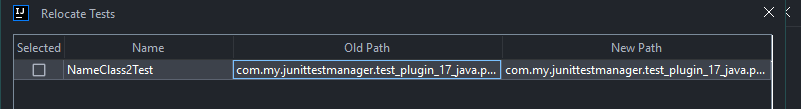

- After relocation, the test class will be placed in `package3` only in the test source root.

**Note**: Only test classes for which the checkbox is selected are moved. By clicking on the `Selected` header, you can select or deselect all checkboxes.

### In Case of Problems
- **Regex doesn't work**: Make sure the regular expression matches the Java Pattern syntax. Test it on example file paths.
- **Tests are not found**: Check that the classes meet the criteria (annotations, inheritance, or name). Also make sure that test source roots are configured correctly in the project.
- **Relocation broke imports**: In general, this shouldn't happen, but if it did, after relocation, manually update the imports in the test if they didn't update automatically.
- If other problems occur, enable logging in the plugin settings and check the logs for diagnostics.

### Contribution
- If you have ideas for improving the plugin or want to report a bug, please create an [issue](https://github.com/Kuznetsov-Igor/Junit-Test-Manager/issues)
- Help in development is welcome! You can always create a pull request with improvements or new features.

### Tested on
Tested on:
- Ubuntu 20.04.6 LTS
    - IntelliJ IDEA 2024.1.6 (Community Edition) Runtime version: 17.0.11+1-b1207.30 amd64, VM: OpenJDK 64-Bit Server VM by JetBrains s.r.o.
- Windows 10 Pro 22H2 19045.6456
    - IntelliJ IDEA 2024.1.4 (Ultimate Edition), Runtime version: 17.0.11+1-b1207.24 amd64 , VM: OpenJDK 64-Bit Server VM by JetBrains s.r.o.