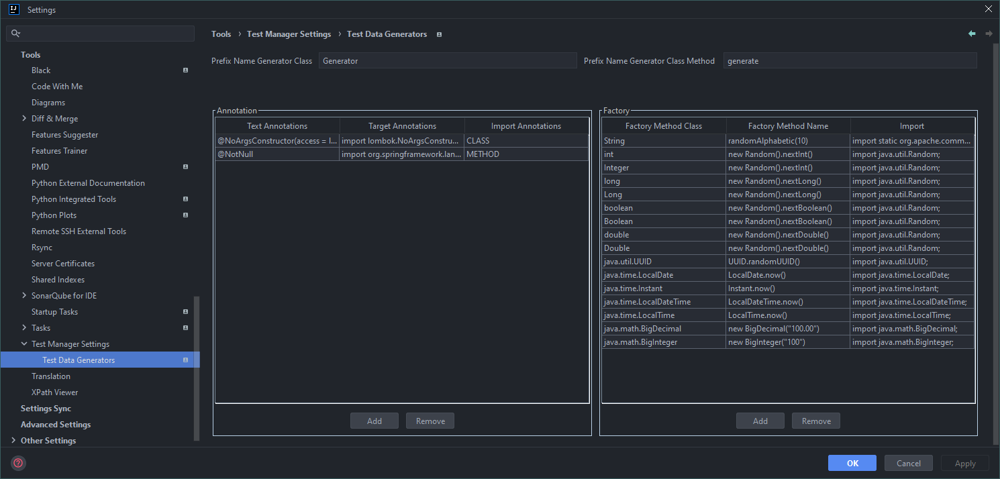
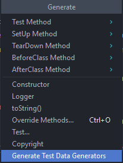
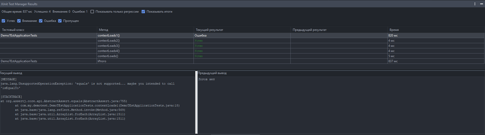

# JUnit Test Manager Plugin

This IntelliJ IDEA plugin simplifies the way you search for, group, and run JUnit tests. It also automates moving misplaced test classes and generating reusable test data objects.

## Contents
- [Requirements](#requirements)
- [Button Location](#button-location)
- [Settings Location](#settings-location)
- [Settings](#settings)
  - [Profiles](#profiles)
  - [Groups](#groups)
- [Settings for Generating Test Data Objects](#settings-for-generating-test-data-objects)
  - [Class Name](#class-name-for-generating-test-data-objects)
  - [Method Name](#method-name-for-generating-test-data-objects)
  - [Annotation Management](#annotation-management)
  - [Generative Method Management](#generative-method-management)
- [Functionality](#functionality)
- [Test Results Tool Window](#test-results-tool-window)
- [Examples](#examples)
  - [Creating Configurations for Selected Tests](#creating-configurations-for-selected-tests)
  - [Creating Configurations for All Tests or Groups](#creating-configurations-for-all-tests-or-groups)
  - [Moving Test Classes Between Packages](#moving-test-classes-between-packages)
- [Screenshots](#screenshots)

## Requirements
- IntelliJ IDEA 2024.1 or higher
- Java 17 for the IDE runtime (already bundled with supported versions)

## Button Location
Plugin actions appear in the context menu under **JUnit Test Manager** when you right-click inside the editor or the Project view.


## Settings Location
Navigate to **Settings** → **Tools** → **Test Manager Settings**.


## Settings
Available options:
- Group management
- Profile management
- Interface language selection
- Logging flag

### Profiles
Profiles decide which groups are active when tests are gathered. They also influence VM arguments and color highlighting.


### Groups
Groups cluster test classes when creating run configurations and define the VM arguments tied to those configurations. They can automatically assign categories based on file paths and apply custom execution options.


Each group contains:
- **Name** — how the group appears in the UI and resulting configurations.
- **Regular expression** — determines whether a test belongs to the group using its project path.  
  - Example: use `.*convert.*` to capture all converters located in packages containing `convert`.  
  - If no regex is provided or it does not match, the test is placed in the default `Default` group. Standard Java `Pattern` syntax is supported.
- **VM arguments** — JVM flags for this group, e.g. `-Dparallel.tests=true -Dthreads=4` or `-Xmx2g`.
- **Color** — background color applied to rows in dialogs for quick visual grouping.
- **Profiles** — list of profiles that can reuse this group, which makes it easy to share setups across projects.

Groups can be created, edited, or deleted right inside the settings. The `Default` group (no regex, no VM args) always exists, but you can override it with your own definition linked to the `Default` profile.

## Settings for Generating Test Data Objects


To launch the generator, open the desired class, right-click on the class declaration, and choose `Generate` → `Generate Test Data Object`.



The dialog contains:
- Class name prefix
- Method name prefix
- Annotation management
- Generative method management

### Class Name for Generating Test Data Objects
Defines the prefix for a generated class, for example `public class ClassDataTestGenerator`.

### Method Name for Generating Test Data Objects
Defines the prefix for a generated method, e.g. `public static ClassObjectData generateClassDataTest()`.

### Annotation Management
Add, edit, or remove annotations that decorate generated classes or methods. Example:
```java
@NoArgsConstructor(access = lombok.AccessLevel.PRIVATE)
public class ClassObjectDataGenerator {
    @NonNull
    public static ClassObjectData generateClassObjectData() {
        return new ClassObjectData(
                randomAlphabetic(20),
                randomAlphabetic(10),
                randomAlphabetic(10),
                randomAlphabetic(10)
        );
    }
}
```

Required fields:
- Annotation text (e.g. `@NonNull`)
- Import (e.g. `import org.springframework.lang.NonNull`)
- Target (class or method)

### Generative Method Management
Register helper methods used to fill specific field types.

Required fields:
- Object type (e.g. `java.lang.String`)
- Method (e.g. `randomAlphabetic(10)`)
- Import (e.g. `import static org.apache.commons.lang3.RandomStringUtils.randomAlphabetic`)

## Functionality
Test classes are detected automatically if they:
- Contain annotations such as `@Test` or `@ParameterizedTest`
- Extend `junit.framework.TestCase`
- Have names ending with `Test`

### 1. Find All Tests in Project
Recursively searches **all** modules and test source roots.

### 2. Find Tests in Changes
Finds test classes that were modified or created. Connect the project to Git so IDEA can track changes accurately.

### 3. Find Tests in Directory
Searches recursively within the selected directory. Available through the context menu on directories.

### 4. Relocate Tests
Analyzes `src/main/java`, finds related tests in the test roots, and verifies packages:
- The test must share the same package as the production class (e.g. `com.example.MyClass` → `com.example.MyClassTest`).
- Matching relies on the `ClassName + "Test"` convention plus the presence of the corresponding import.
- If packages differ, the plugin offers to move the test to the correct package (while keeping the same test source root) and shows a preview dialog.

### 5. Relocate Changes Tests
Same as Relocate Tests, but limited to **changed** production classes.

**Notes**
- Every table supports search and copy.
- `Find Tests in Changes`, `Find All Tests in Project`, `Find Tests in Directory`:
  - Search uses class names only.
  - Copying without a selection exports class paths for every group; copying with a selection exports only the highlighted tests.
- `Relocate Tests`, `Relocate Changes Tests`:
  - Search uses class names only.
  - Copying exports class names.
  - Double-clicking opens the class in IDEA.

## Test Results Tool Window
Once tests finish, IntelliJ IDEA emits SMTRunner events that the plugin intercepts. Results appear inside the `JUnit Test Manager Results` tool window (`View` → `Tool Windows` → `JUnit Test Manager Results`). The window opens automatically with fresh data:

- **Run summary.** Displays total duration plus counts of passed, warning, and failed tests. *Show totals* toggles per-class summary rows, and *Regressions only* highlights tests whose status changed relative to the previous run.
- **Status filters.** Checkboxes let you hide or show successful, warning, failed, and ignored rows to focus on what matters.
- **Per-test history.** The service stores the previous status and log for each method, making regressions immediately visible.
- **Navigation and logs.** Double-click the method column to jump to the exact test method (or the class if the method cannot be resolved). Double-click elsewhere to open the log viewer: the left pane shows the current run, the right pane shows the previous run.
- **Native integration.** Everything is wired into the standard SMTRunner pipeline, so no additional setup is required.



## Examples
Simple settings are used for the examples below.


### Creating Configurations for Selected Tests
- Profile `package1` is active.
- A group with regex `.*package1.*` is configured.
- The dialog shows one custom group plus the default group.


Two classes are selected, resulting in two run configurations. Each configuration inherits the VM arguments of its group.


### Creating Configurations for All Tests or Groups
1. Configure the groups and profiles.


2. Collect all detected test classes.


3. Generate configurations for every group.


**Note:** A single configuration can include multiple classes per group; they are specified via regex `Pattern`.

### Moving Test Classes Between Packages
Settings do not affect this feature. The plugin analyzes files in the main source root and finds their tests.
- Suppose `NameClass2` lives in `package2`, but you moved it to `package3`.
- `NameClass2Test` remains in `package2`, follows the correct naming convention, and imports the production class, so it can be relocated automatically.


After confirmation, the test is placed in `package3` (inside the test source root). Only rows with checked boxes are moved; click the `Selected` header to toggle all rows.

## Troubleshooting
- **Regex does not work**: Ensure the pattern matches Java `Pattern` syntax and test it with actual paths.
- **Tests are not found**: Confirm the classes meet the detection criteria and that test source roots are configured.
- **Imports broke after moving**: This should not happen, but if it does, fix the imports manually.
- **Other issues**: Enable plugin logging in the settings and inspect the IDE logs.
- **Test Data objects are not generated**: Run the action on the class level, make sure the class contains fields, double-check the generator settings, and retry after indexing (or create the missing package and rerun).

## Contribute
- Have an idea or a bug to report? Create an [issue](https://github.com/Kuznetsov-Igor/Junit-Test-Manager/issues).
- Pull requests with improvements or new features are welcome.

## Tested On
- Ubuntu 20.04.6 LTS  
  - IntelliJ IDEA 2024.1.6 (Community Edition) Runtime: 17.0.11+1-b1207.30 (JetBrains OpenJDK)  
  - IntelliJ IDEA 2025.2.3 (Community Edition) Runtime: 21.0.8+9-b1038.72 (JCEF 122.1.9)
- Windows 10 Pro 22H2 19045.6456  
  - IntelliJ IDEA 2024.1.4 (Ultimate Edition) Runtime: 17.0.11+1-b1207.24 (JetBrains OpenJDK)
