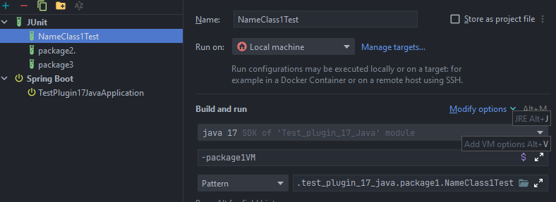

# JUnit Test Manager Plugin

Этот плагин для IntelliJ IDEA упрощает управление и запуск JUnit-тестов, позволяя группировать их по профилям и регулярным выражениям, а также автоматизировать поиск и перемещение тестовых классов.

## Оглавление
- [Требования](#требования)
- [Расположение кнопок](#расположение-кнопок)
- [Расположение настроек](#расположение-настроек)
- [Настройки](#настройки)
    - [Профили](#профили)
    - [Группы](#группы)
- [Функционал](#функционал)
- [Примеры](#примеры)
    - [Создание конфигураций для выбранных тестов](#создание-конфигураций-для-выбранных-тестов)
    - [Создание конфигураций для всех тестов или групп](#создание-конфигураций-для-всех-тестов-или-групп)
    - [Перемещение тестовых классов по пакетам](#перемещение-тестовых-классов-по-пакетам)

## Требования
- IntelliJ IDEA 2024.1 или выше
- Java 17 для runtime IntelliJ IDEA (версии 2024.1 и выше уже требуют и поддерживают эту версию)

## Расположение кнопок
Кнопки плагина доступны в контекстном меню при правом клике в редакторе кода или на панели проекта. Они сгруппированы под пунктом **JUnit Test Manager**.

## Расположение настроек
Настройки плагина доступны в разделе **Settings** → **Tools** → **Test Manager Settings**.

## Настройки
В настройках доступны следующие опции:
- Управление группами
- Управление профилями
- Выбор языка интерфейса
- Флаг логирования

### Профили
Профили определяют, какие группы активны при группировке тестовых классов, а также влияют на аргументы VM и цветовое выделение.

### Группы
Группы отвечают за группировку тестовых классов при формировании конфигураций запуска и за определение аргументов VM для этих конфигураций. Группы позволяют автоматически присваивать тестовым классам категории на основе путей к файлам и применять специфические настройки запуска.

У группы есть 4 параметра:
- **Наименование**: Название группы, отображаемое в интерфейсе плагина и в конфигурациях.
- **Регулярное выражение**: Определяет, к какой группе относится тест, на основе его пути в проекте. Например:
    - Если нужно выделить все конвертеры в группу `Convert` (известно, что они находятся в пакетах с `convert` в названии), используйте регулярное выражение `.*convert.*`. Теперь любой тест, у которого в пути встречается `convert`, будет автоматически отнесён к этой группе. Можно писать более сложные регулярные выражения — зависит от вашей фантазии.
    - Если regex не задан или не совпадает, тест попадает в группу по умолчанию `Default`. Regex поддерживает стандартный синтаксис Java (Pattern.compile).
- **Аргументы VM**: Аргументы виртуальной машины Java, с которыми будут запускаться тестовые классы данной группы. Например:
    - `-Dparallel.tests=true -Dthreads=4` — для параллельного выполнения тестов.
    - `-Xmx2g` — для увеличения размера heap, если тестовые классы требуют много памяти.
- **Цвет**: Цвет для визуального выделения группы в таблицах (ячейки окрашиваются в этот цвет). По умолчанию — серый. Помогает быстро различать группы в диалогах.
- **Профили**: Определяет, для каких профилей подходит данная группа; можно комбинировать их на случай разных проектов с похожими группами.

Группы можно добавлять, редактировать и удалять прямо из настроек. По умолчанию всегда есть группа `Default` (без regex и аргументов VM); её можно переопределить, создав свою без regex и привязав к профилю `Default`.

## Функционал
Тестовые классы определяются автоматически:
- Классы с аннотацией `@Test` (или `@ParameterizedTest` и подобными).
- Классы, наследующие от `junit.framework.TestCase`.
- Классы с именем, заканчивающимся на `Test`.

### 1. Find All Tests in Project
Находит **все** тестовые классы в проекте (рекурсивно по всем модулям и test source roots).

### 2. Find Tests in Changes
Находит тестовые классы, изменённые или добавленные. Для корректного отслеживания файлов рекомендуется подключить проект к Git, чтобы IDEA могла определить изменения.

### 3. Find Tests in Directory
Находит тестовые классы в выбранной директории (рекурсивно). Доступно только при правом клике на директорию в проекте.

### 4. Relocate Tests
Анализирует все классы в `src/main/java`, находит связанные тестовые классы в test source roots и проверяет соответствие пакетов:
- Тест должен быть в том же пакете, что и класс (например, `com.example.MyClass` → `com.example.MyClassTest`).
- Связь определяется по имени (`ClassName + "Test"`) и наличию импорта класса в тесте.
- Если пакеты не совпадают, предлагает переместить тест в пакет класса (с сохранением test source root). Показывает диалог с превью.

### 5. Relocate Changes Tests
Аналогично `Relocate Tests`, но анализирует только **изменённые** классы в main source roots.

**Примечание**:
- Для всех таблиц работает поиск и копирование.
    - Для функционала `Find Tests in Changes`, `Find All Tests in Project`, `Find Tests in Directory`: 
      - Поиск только по имени класса;
      - При копировании копируются только пути к классам с новой строки. Если не выбраны конкретные тестовые классы, конфигурация создастся для всех тестов по группам;
      - Если выбраны, то только для выбранных и по группам.
    - Для функционала `Relocate Tests`, `Relocate Changes Tests`: 
      - Поиск только по имени класса; 
      - При копировании копируется только наименование класса с новой строки;
      - Двойной клик на имени класса откроет файл в IDEA.

## Примеры
Для примеров используются простые настройки.

### Создание конфигураций для выбранных тестов
- В настройках активен профиль `package1`;
- У группы указан regex `.*package1.*`.
- Как видно, определилась 1 наша группа и группа по умолчанию.

- Для примера выделены первые 2 класса, чтобы создать конфигурации только для них. В результате создались 2 конфигурации, и к одной из них применились аргументы, указанные для нашей группы.

### Создание конфигураций для всех тестов или групп
- Настройки.

- Найденные тестовые классы.

- Наши конфигурации под каждую группу.

**Примечание**: В тестовой конфигурации под одну группу может быть N тестовых классов, они указываются через Pattern.

### Перемещение тестовых классов по пакетам
Настройки те же, что и ранее, они не влияют на этот функционал. Мы анализируем файлы в main source root и ищем для них тестовые классы.
- У нас есть класс `NameClass2`, расположенный в `package2`, но мы решили его перенести в другой пакет, например, `package3`.
- Наш тест для этого класса остался в `package2`; он имеет корректное название `NameClass2Test` и в импортах есть ссылка на сам класс `NameClass2`, поэтому этот тестовый класс подходит для перемещения. Мы знаем, куда его стоит определить.

- После перемещения тестовый класс будет размещён в `package3` только в test source root.

**Примечание**: Перемещаются только тестовые классы, для которых выбран чекбокс. По клику на заголовок `Selected` можно выбрать или снять все чекбоксы.

### В случае проблем
- **Regex не работает**: Убедитесь, что регулярное выражение соответствует синтаксису Java Pattern. Протестируйте его на примере путей к файлам.
- **Тесты не находятся**: Проверьте, что классы соответствуют критериям (аннотации, наследование или имя). Также убедитесь, что test source roots настроены корректно в проекте.
- **Перемещение сломало импорты**: В целом такого быть не должно, но если случилось то после перемещения вручную обновите импорты в тесте, если они не обновились автоматически.
- Если возникают другие проблемы, включите логирование в настройках плагина и проверьте логи для диагностики.

### Содействие
- Если у вас есть идеи по улучшению плагина или вы хотите сообщить об ошибке, пожалуйста, создайте [issue](https://github.com/Kuznetsov-Igor/Junit-Test-Manager/issues)
- Помощь в развитии приветствуются! Вы всегда можете создать pull request с улучшениями или новыми функциями.

### Протестировано на
Протестировано:
- Ubuntu 20.04.6 LTS
  - IntelliJ IDEA 2024.1.6 (Community Edition) Runtime version: 17.0.11+1-b1207.30 amd64, VM: OpenJDK 64-Bit Server VM by JetBrains s.r.o.
  - IntelliJ IDEA 2025.2.3 (Community Edition) Runtime version: 21.0.8+9-b1038.72 amd64 (JCEF 122.1.9) VM: OpenJDK 64-Bit Server VM by JetBrains s.r.o.
- Windows 10 Pro 22H2 19045.6456
  - IntelliJ IDEA 2024.1.4 (Ultimate Edition), Runtime version: 17.0.11+1-b1207.24 amd64 , VM: OpenJDK 64-Bit Server VM by JetBrains s.r.o.